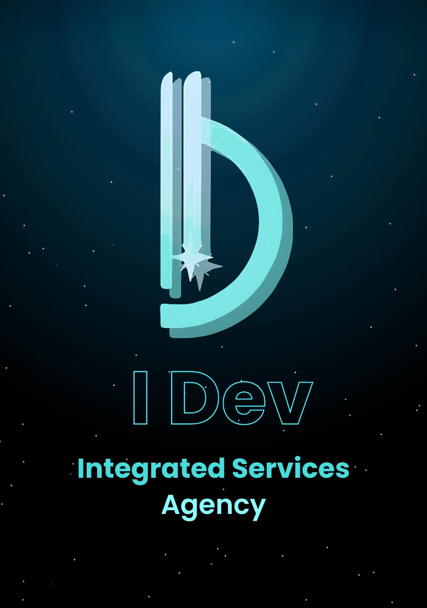

# 🚀 IDEV - منصة الشحن والتوصيل مع تكامل Web3 والبلوك تشين

<div align="center">



**منصة شحن وتوصيل متطورة مع تكامل Web3 والبلوك تشين**

[](https://opensource.org/licenses/MIT)
[](https://reactjs.org/)
[](https://web3.foundation/)
[](https://ethereum.org/)
[](https://internetcomputer.org/)

</div>

## 📋 جدول المحتويات

- [نظرة عامة](#-نظرة-عامة)
- [الميزات الرئيسية](#-الميزات-الرئيسية)
- [تكوين بوابة الدفع Web3](#-تكوين-بوابة-الدفع-web3)
- [التقنيات المستخدمة](#-التقنيات-المستخدمة)
- [التثبيت والإعداد](#-التثبيت-والإعداد)
- [الاستخدام](#-الاستخدام)
- [المساهمة](#-المساهمة)
- [الترخيص](#-الترخيص)

## 🌟 نظرة عامة

**IDEV** هي منصة شحن وتوصيل متطورة تجمع بين التقنيات التقليدية وأحدث تقنيات Web3 والبلوك تشين. توفر المنصة تجربة شاملة لإدارة الشحنات والتوصيل مع دعم المدفوعات اللامركزية والعقود الذكية.

### 🎯 الهدف
إنشاء منصة شحن وتوصيل متكاملة تستفيد من قوة تقنيات Web3 والبلوك تشين لتوفير:
- **شفافية كاملة** في عملية الشحن
- **أمان متقدم** للمعاملات المالية
- **لامركزية** في إدارة البيانات
- **تكامل** مع مختلف شبكات البلوك تشين

## ✨ الميزات الرئيسية

### 🏠 **لوحات التحكم المتخصصة**
- **لوحة تحكم العميل** - إدارة الطلبات والتتبع
- **لوحة تحكم المتجر** - إدارة المخزون والطلبات
- **لوحة تحكم السائق** - تتبع الرحلات والتوصيل
- **لوحة تحكم الإدارة** - مراقبة النظام والإحصائيات

### 🔐 **نظام مصادقة متقدم**
- **تسجيل متعدد المراحل** مع التحقق من الهوية
- **تكامل World ID** للتحقق من الهوية
- **Internet Identity** للهوية اللامركزية
- **KYC/AML** للامتثال التنظيمي

### 🚚 **نظام تتبع ذكي**
- **تتبع في الوقت الفعلي** للشحنات
- **خرائط تفاعلية** مع Google Maps
- **إشعارات ذكية** للمستخدمين
- **تحليلات متقدمة** للأداء

### 💰 **نظام دفع Web3 متطور**
- **دفع بالعملات المشفرة** (BTC, ETH, USDT, USDC, DAI)
- **تكامل DeFi** مع بروتوكولات التمويل اللامركزي
- **دفع NFT** للسلع الرقمية
- **عقود ذكية للضمان** (Escrow)

## 💳 تكوين بوابة الدفع Web3

### 🔄 **استبدال بوابات الدفع التقليدية**

تم استبدال بوابات الدفع التقليدية (Stripe, PayPal, Razorpay) بنظام دفع متطور مبني على Web3 والبلوك تشين:

#### ❌ **البوابات التقليدية السابقة:**
```env
# تم إزالة هذه البوابات
STRIPE_PUBLISHABLE_KEY=pk_test_...
PAYPAL_CLIENT_ID=your-paypal-client-id
RAZORPAY_KEY_ID=your-razorpay-key-id
```

#### ✅ **بوابات الدفع الجديدة Web3:**

### 🌐 **بوابات الدفع الرئيسية**

#### 1. **Ethereum Payment Gateway**
```env
ETHEREUM_PAYMENT_GATEWAY_ENABLED=true
ETHEREUM_PAYMENT_CONTRACT_ADDRESS=0x1234567890123456789012345678901234567890
ETHEREUM_PAYMENT_GAS_LIMIT=21000
ETHEREUM_PAYMENT_GAS_PRICE=20000000000
ETHEREUM_PAYMENT_CONFIRMATION_BLOCKS=12
```

#### 2. **Polygon Payment Gateway**
```env
POLYGON_PAYMENT_GATEWAY_ENABLED=true
POLYGON_PAYMENT_CONTRACT_ADDRESS=0x1234567890123456789012345678901234567890
POLYGON_PAYMENT_GAS_LIMIT=21000
POLYGON_PAYMENT_GAS_PRICE=30000000000
POLYGON_PAYMENT_CONFIRMATION_BLOCKS=30
```

#### 3. **Binance Smart Chain (BSC)**
```env
BSC_PAYMENT_GATEWAY_ENABLED=true
BSC_PAYMENT_CONTRACT_ADDRESS=0x1234567890123456789012345678901234567890
BSC_PAYMENT_GAS_LIMIT=21000
BSC_PAYMENT_GAS_PRICE=5000000000
BSC_PAYMENT_CONFIRMATION_BLOCKS=15
```

#### 4. **Internet Computer Protocol (ICP)**
```env
ICP_PAYMENT_GATEWAY_ENABLED=true
ICP_PAYMENT_CANISTER_ID=your-icp-payment-canister-id
ICP_PAYMENT_CYCLES=1000000000
ICP_PAYMENT_TIMEOUT=60000
ICP_PAYMENT_RETRY_ATTEMPTS=3
```

### 🔗 **الميزات المتقدمة**

#### **Multi-Chain Payment Router**
```env
MULTI_CHAIN_PAYMENT_ROUTER_ENABLED=true
MULTI_CHAIN_ROUTER_CONTRACT_ADDRESS=0x1234567890123456789012345678901234567890
MULTI_CHAIN_ROUTER_GAS_LIMIT=100000
```

#### **Cross-Chain Bridge**
```env
CROSS_CHAIN_BRIDGE_ENABLED=true
CROSS_CHAIN_BRIDGE_CONTRACT_ADDRESS=0x1234567890123456789012345678901234567890
CROSS_CHAIN_BRIDGE_GAS_LIMIT=200000
```

#### **Stablecoin Support**
```env
USDT_PAYMENT_ENABLED=true
USDT_CONTRACT_ADDRESS=0xdAC17F958D2ee523a2206206994597C13D831ec7
USDC_PAYMENT_ENABLED=true
USDC_CONTRACT_ADDRESS=0xA0b86a33E6441b8C4C8C0C8C0C8C0C8C0C8C0C8C
DAI_PAYMENT_ENABLED=true
DAI_CONTRACT_ADDRESS=0x6B175474E89094C44Da98b954EedeAC495271d0F
```

#### **DeFi Integration**
```env
DEFI_PAYMENT_ENABLED=true
DEFI_PROTOCOL_ADDRESS=0x1234567890123456789012345678901234567890
DEFI_LIQUIDITY_POOL_ADDRESS=0x1234567890123456789012345678901234567890
DEFI_STAKING_REWARDS_ENABLED=true
```

#### **NFT Payment Support**
```env
NFT_PAYMENT_ENABLED=true
NFT_CONTRACT_ADDRESS=0x1234567890123456789012345678901234567890
NFT_PAYMENT_METHODS=ERC721,ERC1155,ICP_NFT
```

#### **Smart Contract Escrow**
```env
PAYMENT_ESCROW_ENABLED=true
ESCROW_CONTRACT_ADDRESS=0x1234567890123456789012345678901234567890
ESCROW_RELEASE_CONDITIONS=delivery_confirmed,time_based
ESCROW_TIMEOUT_DURATION=604800
```

### 🛡️ **الأمان والحماية**

#### **Payment Security & Validation**
```env
PAYMENT_VALIDATION_ENABLED=true
PAYMENT_SIGNATURE_VERIFICATION=true
PAYMENT_DOUBLE_SPEND_PROTECTION=true
PAYMENT_REPLAY_ATTACK_PROTECTION=true
```

#### **Payment Compliance & KYC**
```env
PAYMENT_KYC_ENABLED=true
PAYMENT_AML_ENABLED=true
PAYMENT_SANCTIONS_CHECK=true
PAYMENT_TRANSACTION_LIMITS=10000
```

### 📊 **المراقبة والتحليلات**

#### **Payment Analytics & Monitoring**
```env
PAYMENT_ANALYTICS_ENABLED=true
PAYMENT_METRICS_COLLECTION=true
PAYMENT_PERFORMANCE_MONITORING=true
PAYMENT_ERROR_TRACKING=true
```

#### **Payment Webhook Configuration**
```env
PAYMENT_WEBHOOK_ENABLED=true
PAYMENT_WEBHOOK_SECRET=your-payment-webhook-secret
PAYMENT_WEBHOOK_TIMEOUT=30000
PAYMENT_WEBHOOK_RETRY_ATTEMPTS=3
```

### 💰 **إعدادات الرسوم**

#### **Payment Fee Configuration**
```env
PAYMENT_FEE_ENABLED=true
PAYMENT_FEE_PERCENTAGE=0.5
PAYMENT_FEE_MINIMUM=0.001
PAYMENT_FEE_MAXIMUM=0.1
PAYMENT_FEE_CURRENCY=ETH
```

#### **Payment Refund Configuration**
```env
PAYMENT_REFUND_ENABLED=true
PAYMENT_REFUND_TIMEOUT=86400
PAYMENT_REFUND_GAS_LIMIT=50000
PAYMENT_REFUND_GAS_PRICE=20000000000
```

### 🧪 **التطوير والاختبار**

#### **Payment Testing & Development**
```env
PAYMENT_TEST_MODE=true
PAYMENT_TEST_NETWORKS=goerli,mumbai,bsc-testnet
PAYMENT_TEST_TOKENS=test-eth,test-usdt,test-usdc
PAYMENT_TEST_AMOUNTS=0.001,0.01,0.1
```

## 🛠️ التقنيات المستخدمة

### **Frontend**
- **React 18+** - مكتبة واجهة المستخدم
- **Vite** - أداة البناء السريعة
- **Tailwind CSS** - إطار عمل CSS
- **Framer Motion** - مكتبة الرسوم المتحركة
- **Radix UI** - مكونات واجهة المستخدم
- **i18next** - الترجمة والدعم متعدد اللغات

### **Backend**
- **Rust** - لغة البرمجة الرئيسية
- **Docker** - حاويات التطبيق
- **PostgreSQL** - قاعدة البيانات الرئيسية
- **Redis** - تخزين مؤقت وجلسات

### **Web3 & Blockchain**
- **Ethereum** - الشبكة الرئيسية
- **Polygon** - حلول Layer 2
- **Binance Smart Chain** - شبكة BSC
- **Internet Computer Protocol** - شبكة ICP
- **Web3.js** - مكتبة التفاعل مع البلوك تشين
- **Ethers.js** - مكتبة إيثيريوم

### **الخدمات الخارجية**
- **Google Maps API** - الخرائط والموقع
- **Twilio** - الرسائل النصية
- **SendGrid** - البريد الإلكتروني
- **OpenAI** - الذكاء الاصطناعي
- **Shopify/WooCommerce** - تكامل المتاجر

## 🚀 التثبيت والإعداد

### **المتطلبات الأساسية**
```bash
# Node.js 18+
node --version

# npm أو pnpm
npm --version
# أو
pnpm --version

# Git
git --version
```

### **1. استنساخ المشروع**
```bash
git clone https://github.com/samar-ux/I-dev.git
cd I-dev
```

### **2. تثبيت التبعيات**
```bash
# Frontend
npm install
# أو
pnpm install

# Backend (إذا كان متوفراً)
cd backend
cargo build
```

### **3. إعداد متغيرات البيئة**
```bash
# انسخ ملف القالب
cp backend/env.example backend/.env
cp config/env.template .env

# حدث القيم حسب احتياجاتك
nano backend/.env
nano .env
```

### **4. إعداد قاعدة البيانات**
```bash
# PostgreSQL
sudo service postgresql start

# Redis
sudo service redis-server start
```

### **5. تشغيل المشروع**
```bash
# Frontend
npm run dev
# أو
pnpm dev

# Backend (إذا كان متوفراً)
cd backend
cargo run
```

## 📖 الاستخدام

### **1. تسجيل الدخول**
- اختر نوع المستخدم (عميل، متجر، سائق، مدير)
- اختر مستوى التحقق (عادي، متقدم، Web3)
- أكمل عملية التسجيل

### **2. إدارة الشحنات**
- إنشاء شحنة جديدة
- تتبع حالة الشحنة
- إدارة المرتجعات

### **3. المدفوعات Web3**
- ربط المحفظة الرقمية
- اختيار العملة المشفرة
- تأكيد المعاملة

### **4. لوحة التحكم**
- عرض الإحصائيات
- إدارة المستخدمين
- مراقبة النظام

## 🤝 المساهمة

نرحب بمساهماتكم! يرجى اتباع الخطوات التالية:

1. **Fork** المشروع
2. إنشاء **branch** جديد (`git checkout -b feature/amazing-feature`)
3. **Commit** التغييرات (`git commit -m 'Add amazing feature'`)
4. **Push** إلى الـ branch (`git push origin feature/amazing-feature`)
5. فتح **Pull Request**

### **معايير المساهمة**
- اتباع معايير الكود المحددة
- كتابة اختبارات للوظائف الجديدة
- تحديث الوثائق عند الحاجة
- استخدام رسائل commit واضحة

## 📄 الترخيص

هذا المشروع مرخص تحت رخصة MIT - راجع ملف [LICENSE](LICENSE) للتفاصيل.

## 📞 الدعم والاتصال

- **GitHub Issues**: [فتح issue](https://github.com/samar-ux/I-dev/issues)
- **Email**: support@idev-shipping.com
- **Website**: https://idev-shipping.com

## 🙏 شكر وتقدير

- فريق تطوير React
- مجتمع Web3 والبلوك تشين
- مطوري Tailwind CSS
- مجتمع المصادر المفتوحة

---

<div align="center">

**🚀 IDEV - مستقبل الشحن والتوصيل مع Web3**

[](https://github.com/samar-ux/I-dev)
[](https://web3.foundation/)
[](https://ethereum.org/)

</div>